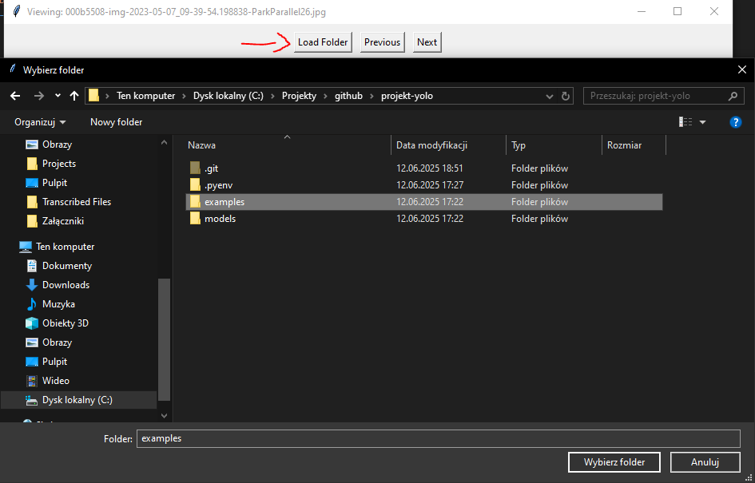
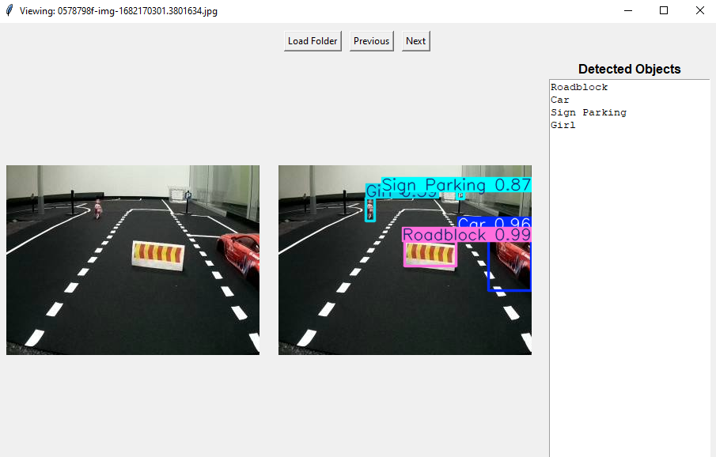

# projekt-yolo

Projekt studencki wykorzystujący YOLO v11 do rozpoznawania wybranych obiektów na obrazach.

## Wykrywane obiekty

- Car  
- Girl  
- Light Green  
- Light Red  
- Light Yellow  
- Roadblock  
- Sign Crosswalk  
- Sign Highway-Entrance  
- Sign Highway-Exit  
- Sign New-Round-About  
- Sign No Entry  
- Sign Oneway  
- Sign Parking  
- Sign Priority  
- Sign Round-about  
- Sign Stop  

## Środowisko

- Python: **3.12.10** (testowane)

## Konfiguracja środowiska

### Windows

```bash
python -m venv venv
venv\Scripts\activate
pip install -r requirements.txt
```

### Linux
```bash
python3 -m venv venv
source venv/bin/activate
pip install -r requirements.txt
```

## Uruchomienie

1. Aktywuj środowisko wirtualne (patrz wyżej).
2. Uruchom skrypt:

```bash
python test-model.py
```

3. Wybierz folder `examples` jako źródło obrazów do testowania.




